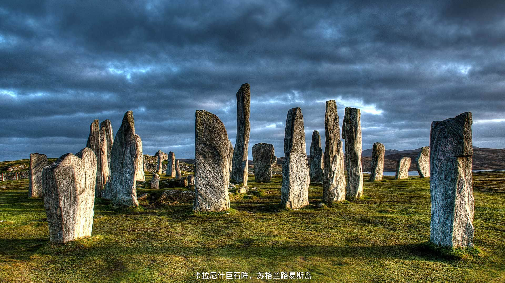

## 链接分析  
　　打开[bing首页](http://cn.bing.com/)，开chrome调试，捕捉network，再点击上一张，下一张时可以看到一个比较规律的URL，[http://cn.bing.com/HPImageArchive.aspx?format=js&idx=1&n=1&nc=1498657985239&pid=hp&video=1](http://cn.bing.com/HPImageArchive.aspx?format=js&idx=1&n=1&nc=1498657985239&pid=hp&video=1)，这个url返回一个json数据如下，里面就有首页图片的url
```json
{
    "images": [
        {
            "startdate": "20170624",
            "fullstartdate": "201706241600",
            "enddate": "20170625",
            "url": "/az/hprichbg/rb/SanLorenzo_ZH-CN7625061136_1920x1080.jpg",
            "urlbase": "/az/hprichbg/rb/SanLorenzo_ZH-CN7625061136",
            "copyright": "圣老楞佐圆形堂，意大利曼托瓦 (© geo-select FotoArt)",
            "copyrightlink": "/search?q=%e5%9c%a3%e8%80%81%e6%a5%9e%e4%bd%90%e5%9c%86%e5%bd%a2%e5%a0%82&form=hpcapt&mkt=zh-cn",
            "quiz": "/search?q=Bing+homepage+quiz&filters=WQOskey:%22HPQuiz_20170624_SanLorenzo%22&FORM=HPQUIZ",
            "wp": true,
            "hsh": "d6370baf98120bf530cea4264b7540b0",
            "drk": 1,
            "top": 1,
            "bot": 1,
            "hs": []
        }
    ],
    "tooltips": {
        "loading": "正在加载...",
        "previous": "上一个图像",
        "next": "下一个图像",
        "walle": "此图片不能下载用作壁纸。",
        "walls": "下载今日美图。仅限用作桌面壁纸。",
        "play": "播放视频",
        "pause": "暂停视频"
    }
}
```
简单测试了下这个url，idx表示当前天往前往后的索引，1表示昨天，-1表示明天，-2请求不到数据。n为请求图片的张数，nc为1970到现在的秒数。

## 添加水印  
　　bing首页的图片还是比较好看的，但终归是外行看热闹，看不懂是啥，是什么地方。所以琢磨在图片上加个水印，想了下，加水印有两种思路，一种是通过云端API处理图片，一种是本地命令行处理图片。查了下，用imagemagick在linux本地加水印很方便，而且我ubuntu直接有装，那么一条命令就可以添加文字水印了。参照了官方[说明文档](http://www.imagemagick.org/Usage/annotating/#wmark_text)，使用这条命令添加：  
```bash
convert 1.jpg -font 文泉驿微米黑 -pointsize 30 -draw "gravity south fill black  text 0,12 '卡拉尼什巨石阵，苏格兰路易斯岛'  fill white  text 1,11 '卡拉尼什巨石阵，苏格兰路易斯岛' " 2.jpg
```  
**注意：**  
如果报错`convert: unable to read font 'Arial' `找不到字体，你可以执行如下命令看下有那些字体`convert -list font`。如果加中文水印，要选用支持中文的字体。
效果图：  
  

