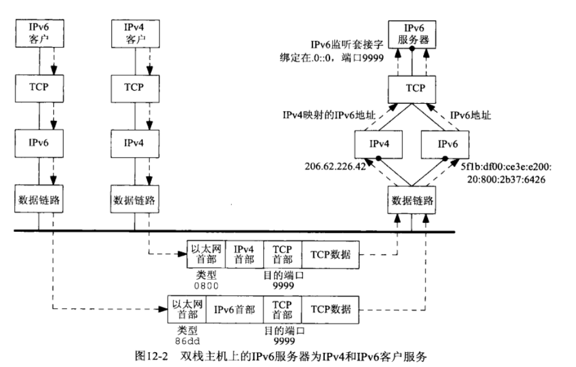

 
> IPV6 socket的练习程序，服务器打印客户端的地址，然后回送收到的消息。  

**运行结果**  
```
root@ubuntu:ipv6_socket# ./server_v6
A clinet connected, ip: ::1, port 56358
recv 25 bytes: hello server, I'm client
A clinet connected, ip: ::ffff:192.168.242.1, port 11111
recv 12 bytes: 123456478764
```
第一个客户端为上面程序实现的客户端，connect的本地环回地址。第二个客户端为一个IPV4的客户端，connect的192.168.242.2的地址。可以看到对于支持双栈的**IPV6服务器，一样可以接受IPV4客户端的连接和通信**，IPV4客户端打印出来的地址为IPV4映射的IPV6地址，这些都由协议栈处理好了。附一张图：  
  


**注意点**
* 客户端connect时不能连接到链路本地地址（fe80开头那个地址），否则会报`connect error:: Invalid argument`的错误，可以connect环回地址，或者用命令`ip addr add 2001::1/64 dev eth0`为接口添加一个IPV6地址。connect的地址长度入参错了，也会报这个错