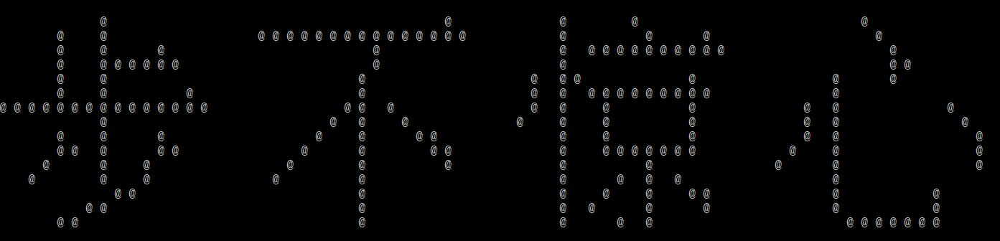

# 使用字符在终端打印图形汉字  
　　主要使用HKZ16点阵字库来实现。顾名思义，HKZ16点阵字库就是把一个汉字拆成16\*16的字符点来显示，在点阵字库中每个汉字占32个字节，256位，当这一位为1时表示需要显示。一个汉字在HKZ16字库中位置有方法计算, 计算出偏移读取出这个字的码表，再按码表来显示就可以了    
*计算汉字在字库中的偏移*  
```
区码 = 汉字的第一个字节 - 0XA0
位码 = 汉字的第二个字节 - 0XA0
offset = (94*(区码-1)+(位码-1))*32
```
显示效果：  
  
[HZK16字库下载](./HZK16)  

**问题：**  
1. 在windows上和ubuntu显示效果不一样，ubuntu连接telnet显示不美观，中间有换行  
2. 汉字中遇到英文字符或者数字，打印会乱码。这一点可以通过判断首个字符的ASSIC码来判断是否是汉字  
3. 如何打印图形的字符，可以使用其他字库，如ASC16

*其他点阵字库*  
```
ASC12  ' 8x12 ASCII点阵 一个字符12Byte
ASC16  ' 8x16 ASCII点阵 一个字符16Byte
ASC48  '24x48 ASCII点阵 一个字符144Byte

HZK12  '16x12 宋体汉字点阵  一个汉字24Byte
HZK14  '16x14 宋体汉字点阵  一个汉字28Byte
HZK16  '16x16 宋体汉字点阵  一个汉字32Byte
HZK16F '16x16 繁体宋体汉字点阵  一个汉字32Byte

HZK24F '24x24 仿宋汉字打印点阵  一个汉字72Byte
HZK24H '24x24 黑体汉字打印点阵  一个汉字72Byte
HZK24K '24x24 楷体汉字打印点阵  一个汉字72Byte
HZK24S '24x24 宋体汉字打印点阵  一个汉字72Byte
HZK24T '24x24 宋体符号打印点阵  一个符号72Byte

HZK40S '40x40 宋体汉字点阵  一个汉字200Byte
HZK40T '40x40 宋体符号点阵  一个符号200Byte

HZK48S '48x48 宋体汉字点阵  一个汉字288Byte
HZK48T '48x48 宋体符号点阵  一个符号288Byte
```

***

*代码*  
```c
#include <stdio.h>
#include <string.h>

#define DRAW_CHAR '@'
#define HZK16 "HZK16"

// CC: chinese character

// 计算该汉字在字库中的偏移
int get_CC_offset(char *s)
{
    unsigned char part_code = s[0] - 0xA0;    //区码
    unsigned char site_code = s[1] - 0xA0;    //位码

    return (94 * (part_code - 1) + (site_code - 1)) * 32;
}

int is_set_bit(char *s, int off)
{
    return *(s + off / 8) & (0x80 >> (off % 8));
}

//终端放到最大一行最多打四个汉字，两个显示最好
void print_line_n_CC(char *s, int n)
{
    if(!s || n * 2 > strlen(s) || n > 4)
        return;

    int offset = 0;
    int i = 0, j = 0, k = 0;
    char **code_table = NULL;
    FILE *fp = fopen(HZK16, "rb");

    if(!fp)
    {
        printf("fopen %s error: %m\n", HZK16);
        return;
    }

    code_table = (char **)malloc(n * sizeof(char *));
    for(i = 0; i < n; i++)
        code_table[i] = (char *)malloc(32);

    // 计算偏移，得到该汉字的码表
    for(i = 0; i < n; i++)
    {
        offset = get_CC_offset(s + i * 2);
        fseek(fp, offset, SEEK_SET);
        fread(code_table[i], 32, 1, fp);
    }
    fclose(fp);

    for(i = 0; i < 16; i++)
    {
        for(j = 0; j < n * 16; j++)
        {
            if(j != 0 && j % 16 == 0)
                printf("    ");

            if(is_set_bit(code_table[j / 16], i * 16 + j % 16 - 16))
                printf("%c ", DRAW_CHAR);
            else
                printf("  ");
            
        }
        printf("\n");
    }
    printf("\n");

    for(i = 0; i < n; i++)
        free(code_table[i]);
    free(code_table);
}

void print_CC(char *s, int line_max_char)
{
    if(!s)
        return;

    if(line_max_char > 4)
    {
        printf("line max print 4 chinese charcter\n");
        return; 
    }

    int i = 0;
    int len = strlen(s);
    int max_len = 0;

    for(i = 0; i < len; i = i + 2 * line_max_char)
    {
        if( i + line_max_char * 2 > len)
            max_len = (len - i) / 2;
        else
            max_len = line_max_char;
            
        print_line_n_CC(s + i, max_len);
    }
}

int main(int argc, char const *argv[])
{
    print_line_n_CC("步不惊心", 4);
    print_line_n_CC("珠玑", 2);
    print_CC("我的老嘎就住在这个屯", 4);
    return 0;
}
```

**参考**  
http://blog.csdn.net/l_backkom/article/details/38414645  
http://blog.csdn.net/u011766068/article/details/11474159  